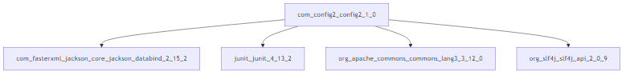

# Визуализатор зависимостей для Maven-проектов

## Постановка задачи

Цель проекта — разработать инструмент командной строки для визуализации графа зависимостей, включая транзитивные зависимости, без использования сторонних средств для получения зависимостей. Зависимости определяются по именам пакетов Maven (Java). Граф представляется в формате **Mermaid** и сохраняется в виде PNG-файла.

### Аргументы командной строки
- `--graph-tool` (Обязательно): Путь к инструменту для визуализации графов.
- `--package` (Обязательно): Имя анализируемого пакета в формате `groupId:artifactId:version`.
- `--output` (Обязательно): Путь к файлу, в который будет сохранено изображение графа зависимостей.
- `--repo-url` (Обязательно): URL-адрес репозитория Maven.

---

## Описание решения

### Основные функции

1. **Загрузка POM-файлов**: Скачивание и парсинг POM-файлов из указанного репозитория Maven.
2. **Разрешение зависимостей**: Рекурсивное разрешение прямых и транзитивных зависимостей.
3. **Генерация Mermaid-графа**: Построение графа зависимостей в формате Mermaid.
4. **Визуализация графа**: Использование внешнего инструмента для преобразования графа Mermaid в изображение PNG.
5. **Логирование и обработка ошибок**: Подробные логи для отладки и обработка отсутствующих зависимостей.

---

### Обзор функций

1. **`get_pom_file_path(group_id, artifact_id, version)`**  
   Формирует путь к POM-файлу в репозитории Maven.

2. **`fetch_pom_file(group_id, artifact_id, version)`**  
   Загружает и парсит POM-файл для указанного артефакта.

3. **`parse_dependencies(pom_root)`**  
   Извлекает зависимости из POM-файла.

4. **`resolve_dependencies(group_id, artifact_id, version)`**  
   Рекурсивно разрешает все зависимости (прямые и транзитивные).

5. **`generate_mermaid(dependencies)`**  
   Генерирует Mermaid-граф из разрешенных зависимостей.

6. **`save_graph_image(mermaid_code)`**  
   Сохраняет Mermaid-граф в формате PNG с использованием указанного инструмента.

7. **`visualize(group_id, artifact_id, version)`**  
   Осуществляет полный процесс: разрешение зависимостей, генерацию графа и сохранение изображения.

---

## Пример использования

### Запуск программы
Для запуска программы выполните следующую команду в консоли:

```bash
python main.py --graph-tool "C:\Users\Admin\AppData\Roaming\npm\mmdc.cmd" --package "com.config2:config2:1.0" --output "graph.png" --repo-url "C:/Users/Admin/.m2/repository"
```

### Пример вывода
- **Изображение графа зависимостей:** PNG-файл, показывающий граф зависимостей.
- **Логи:** Вывод в терминал, указывающий прогресс разрешения зависимостей и генерации графа.


---

## Результаты

### Пример графа зависимостей
Ниже приведен пример сгенерированного Mermaid-графа:


